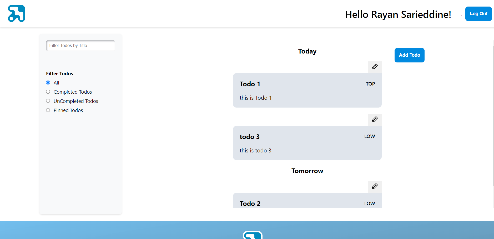

<br><br>

<!-- project philosophy -->


### Features:

- User Registration: Intuitive registration form for easy sign-up.
- Google Integration: Simplified sign-in and registration process via Google.
- Authentication: Secure user authentication leveraging JSON Web Tokens (JWT).
- Email Verification: Customized email verification to enhance user trust and security.
- Forgot Password: A robust service that sends an email with redirection links following a security verification.
- Password Reset: Directs users to a dedicated page for secure password resetting.
- Rate Limiting: Implements a rate limit of 10 requests per minute for each user to ensure fair usage (prevent brute force attacks).
- Comprehensive Error Handling and Data Validation: Across both frontend and backend, ensuring reliability and user-friendly error feedback.
- Design: A responsive and contemporary design, prioritizing a seamless and intuitive user experience (UX).
- State Management: Utilizes Redux for efficient local data handling and state management.
- Routing: Leverages React Router for dynamic and responsive page navigation.
- API Integration: Well-structured architecture for seamless API requests, facilitating remote data access.
- Folder Structure: Methodically organized for easy navigation, supporting efficient development and maintenance of both frontend and backend.
- React Ecosystem: Incorporates both custom and pre-built React hooks, alongside local storage, for optimized performance.
- Testing: Comprehensive API testing implemented with Jest for assured reliability.
- TypeScript: Adoption of TypeScript for robust, type-safe coding, minimizing errors and enhancing code quality.
- Database Design: Advanced database architecture crafted with Prisma, ensuring scalability and efficient data management.
- User Features:

  - User can sign-up using form or google
  - User confirmation email sent upon sign-up (with form)
  - User password reset email sent upon request
  - User can reset password via password reset link
  - For security: password hashing, email confirmation, reset password confirmation, brute force attacks protection (rate limiting), jwt authentication

- Todo Features:

  - User can add, edit and delete Todos (only the ones that belong to user)
  - User can filter Todos by complete, uncomplete and pinned status
  - Todos with the same date are grouped together and shown in an increasing order (date-wise)
  - Todos within the same date group are organized by priority (most important first)
  - User can search for todos through title-keyword search
  - User can pin and complete todos

  <br><br>

### API Documentation:

- You can find the comprehensive API documentation for the TODO App through the following link: [Documentation](https://app.swaggerhub.com/apis/RayanSarieddine/maxiphy/1.0.0).

  

<br><br>

<!-- Figma Designs -->


> The design process for this web app began with meticulous planning. This foundational step ensured a cohesive and well-organized structure,which was done through Figma, where detailed wireframes and sophisticated mockups were meticulously crafted, laying the groundwork for a visually compelling and user-friendly design.

- For the full Figma Design Page: [figma](https://www.figma.com/file/Xro58VJPn7fgCsy8AM4sIU/Paws?type=design&node-id=415%3A451&mode=design&t=NO8l9gwhjJmY5QZ1-1)

### Wireframes

| Login Page
| --------------------------------------------------------
| 

<table>
  <tr>
    <th>Signup Page</th>
    <th>Forgot Password Page</th>
    <th>Reset Password Page</th>

  </tr>
  <tr>
    <td></td>
    <td></td>
    <td></td>

</table>
<table>
  <tr>
    <th>Home Page</th>
    <th>Home-Not Logged In Page</th>
    <th>Add-Todo Page</th>

  </tr>
  <tr>
    <td></td>
    <td></td>
    <td></td>

  </tr>
</table>
<br><br>

### Mockups

| Login Page
| --------------------------------------------------------
| 

<table>
  <tr>
    <th>Signup Page</th>
    <th>Forgot Password Page</th>
    <th>Reset Password Page</th>

  </tr>
  <tr>
    <td></td>
    <td></td>
    <td></td>

  </tr>
</table>
<table>
  <tr>
    <th>Home Page</th>
    <th>Home-Not Logged In Page</th>
    <th>Add-Todo Page</th>

  </tr>
  <tr>
    <td></td>
    <td></td>
    <td></td>

  </tr>
</table>
<br><br>

<!-- Implementation -->


### Processes

| Google Sign Up Process
| --------------------------------------------------------
| 

| Sign-Up Process  
| -----------------------------------------------------------
| 

| Email Verification & Login Process
| ------------------------------------------------
| 

| Reset Password Process
| ------------------------------------------------------------
| 

| Rate Limiting Example (User allowed 10 requests per 1 minute)
| -------------------------------------------------------
| 

| Add Todo
| --------------------------------------------------------
| 

| Edit/Delete Todo
| -----------------------------------------------------------
| 

| Filter Todos
| ------------------------------------------------
| 

| Search Todos
| ------------------------------------------------------------
| 

| Responsive Design Example
| -------------------------------------------------------
| 

### Pages:

| Login Page                                   | Sign-Up Page                                     |
| -------------------------------------------- | ------------------------------------------------ |
|  |  |

| Forget-Password Page                                             | Reset-Password Page                                            |
| ---------------------------------------------------------------- | -------------------------------------------------------------- |
|  |  |

| Home Page                                  | Add Todo Page                                 |
| ------------------------------------------ | --------------------------------------------- |
|  |  |

<!-- Tech stack -->


### This full stack application is built using the following technologies:

- Frontend Development: The client-side of the application is built using the React library. React is a popular JavaScript library for building user interfaces, especially for single-page applications. It enables us to create reusable UI components and manage the state of the application efficiently, providing a dynamic and responsive user experience.

- Backend Development: For the server-side logic, the application uses NestJS, a progressive Node.js framework for building efficient, reliable, and scalable server-side applications. NestJS leverages TypeScript and provides an out-of-the-box application architecture that allows for easy maintenance and the development of robust web applications.

- Database Management: The application's data persistence is managed using PostgreSQL, a powerful, open-source object-relational database system. PostgreSQL offers advanced features, such as reliable transactions and concurrency without read locks, making it suitable for handling complex data structures and ensuring data integrity.

- Object Relational Mapping (ORM): To interact with the PostgreSQL database, the project utilizes Prisma, a next-generation ORM for Node.js and TypeScript. Prisma simplifies database access, makes it easy to manage database migrations, and provides a straightforward way to query data, significantly reducing the amount of boilerplate code required for database operations.

- TypeScript: The entire project is developed using TypeScript, a superset of JavaScript that adds static types to the language. TypeScript helps in catching errors early through its compile-time type checking and enhances the development experience with better tooling, ultimately leading to more robust and maintainable code.

<br><br>

<!-- How to run -->


> To set up the full stack app locally, follow these steps:

### Prerequisites

Before you begin, ensure you have met the following requirements:

- Node.js and npm:
  ```sh
  npm install npm@latest -g
  ```
- PsotgreSQL for the Database Management:
  ```sh
  Install PostgreSQL from the official website.
  ```

Installation & Setup

Follow these steps to install and set up this full stack app on your local environment.

1- Clone the repo:

```sh
git clone https://github.com/Rayan-Sarieddine/full-stack-demo
```

2- Run the server:

```sh
cd backend
npm start
```

3- Start the React app:

```sh
cd frontend
npm start
```

Now, you should be able to run this app locally and explore its features.
