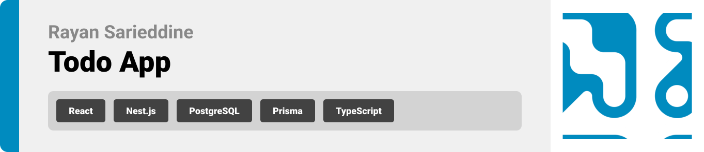
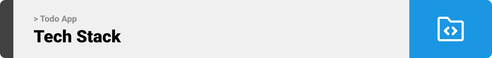

<br><br>

<!-- project philosophy -->


> This Full Stack app was built using Nest.js, PostgreSQL, Prisma, React and Typescript.

<br><br>

<!-- Implementation -->


### Pages

| Login
| --------------------------------------------------------
| 

| Register  
| -----------------------------------------------------------
| 

| Verify Email
| ------------------------------------------------
| 

| Forget Password
| ------------------------------------------------------------
| 

| Reset Password
| -------------------------------------------------------
| 

| Home
| ----------------------------------------------------------------
| 

<!-- Tech stack -->


### This full stack application is built using the following technologies:

- Frontend Development: The client-side of the application is built using the React library. React is a popular JavaScript library for building user interfaces, especially for single-page applications. It enables us to create reusable UI components and manage the state of the application efficiently, providing a dynamic and responsive user experience.

- Backend Development: For the server-side logic, the application uses NestJS, a progressive Node.js framework for building efficient, reliable, and scalable server-side applications. NestJS leverages TypeScript and provides an out-of-the-box application architecture that allows for easy maintenance and the development of robust web applications.

- Database Management: The application's data persistence is managed using PostgreSQL, a powerful, open-source object-relational database system. PostgreSQL offers advanced features, such as reliable transactions and concurrency without read locks, making it suitable for handling complex data structures and ensuring data integrity.

- Object Relational Mapping (ORM): To interact with the PostgreSQL database, the project utilizes Prisma, a next-generation ORM for Node.js and TypeScript. Prisma simplifies database access, makes it easy to manage database migrations, and provides a straightforward way to query data, significantly reducing the amount of boilerplate code required for database operations.

- TypeScript: The entire project is developed using TypeScript, a superset of JavaScript that adds static types to the language. TypeScript helps in catching errors early through its compile-time type checking and enhances the development experience with better tooling, ultimately leading to more robust and maintainable code.

<br><br>

<!-- How to run -->


> To set up Coffee Express locally, follow these steps:

### Prerequisites

Before you begin, ensure you have met the following requirements:

- Node.js and npm:
  ```sh
  npm install npm@latest -g
  ```
- PsotgreSQL for the Database Management:
  ```sh
  Install PostgreSQL from the official website.
  ```

Installation & Setup

Follow these steps to install and set up Paws on your local environment. The setup is divided into sections for the web platform, mobile app, and Arduino.

1- Clone the repo:

```sh
git clone https://github.com/Rayan-Sarieddine/full-stack-demo
```

2- Run the server:

```sh
cd backend
npm start
```

3- Start the React app:

```sh
cd frontend
npm start
```

Now, you should be able to run this app locally and explore its features.
